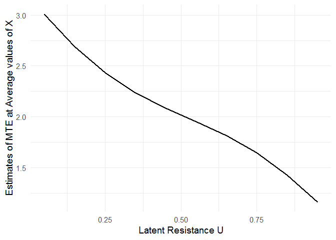
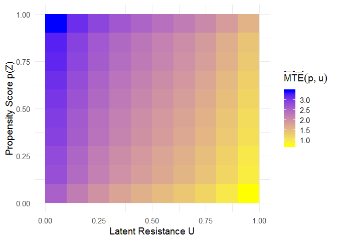
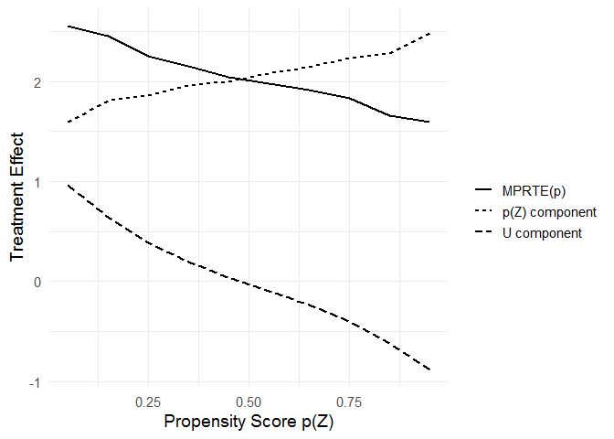

<!-- README.md is generated from README.Rmd. Please edit that file -->

# localIV: Estimation of Marginal Treatment Effects using Local Instrumental Variables

In the generalized Roy model, the marginal treatment effect (MTE) can be
used as a building block for constructing conventional causal parameters
such as the average treatment effect (ATE) and the average treatment
effect on the treated (ATT). Given a treatment selection equation and an
outcome equation, the function `mte()` estimates the MTE via the
semiparametric local instrumental variables (localIV) method or the
normal selection model. The function `mte_at()` evaluates MTE at
different values of the latent resistance *u* with a given *X* = *x*,
and the function `mte_tilde_at()` evaluates MTE projected onto the
estimated propensity score. The function `ace()` estimates
population-level average causal effects such as ATE, ATT, or the
marginal policy relevant treatment effect (MPRTE).

**Main References**

  - Heckman, James J., Sergio Urzua, and Edward Vytlacil. 2006.
    “[Understanding Instrumental Variables in Models with Essential
    Heterogeneity.](https://www.mitpressjournals.org/doi/abs/10.1162/rest.88.3.389)”
    The Review of Economics and Statistics 88:389-432.

  - Zhou, Xiang and Yu Xie. 2019. “[Marginal Treatment Effects from A
    Propensity Score
    Perspective.](https://www.journals.uchicago.edu/doi/abs/10.1086/702172)”
    Journal of Political Economy, 127(6): 3070-3084.

  - Zhou, Xiang and Yu Xie. 2020. “[Heterogeneous Treatment Effects in
    the Presence of Self-selection: a Propensity Score
    Perspective.](https://journals.sagepub.com/doi/abs/10.1177/0081175019862593)”
    Sociological Methodology.

## Installation

You can install the released version of localIV from
[CRAN](https://CRAN.R-project.org) with:

``` r
install.packages("localIV")
```

And the development version from [GitHub](https://github.com/) with:

``` r
# install.packages("devtools")
devtools::install_github("xiangzhou09/localIV")
```

## Example

Below is a toy example illustrating the use of `mte()` to fit an MTE
model using the local IV method.

``` r
library(localIV)

mod <- mte(selection = d ~ x + z, outcome = y ~ x, data = toydata, bw = 0.2)

# fitted propensity score model
summary(mod$ps_model)
#> 
#> Call:
#> glm(formula = selection, family = binomial("probit"), data = mf_s)
#> 
#> Deviance Residuals: 
#>     Min       1Q   Median       3Q      Max  
#> -3.4345  -0.6555   0.0115   0.6392   3.3983  
#> 
#> Coefficients:
#>             Estimate Std. Error z value Pr(>|z|)    
#> (Intercept)  0.01798    0.01580   1.138    0.255    
#> x            0.95263    0.02065  46.124   <2e-16 ***
#> z            1.00431    0.02088  48.094   <2e-16 ***
#> ---
#> Signif. codes:  0 '***' 0.001 '**' 0.01 '*' 0.05 '.' 0.1 ' ' 1
#> 
#> (Dispersion parameter for binomial family taken to be 1)
#> 
#>     Null deviance: 13862.7  on 9999  degrees of freedom
#> Residual deviance:  8217.1  on 9997  degrees of freedom
#> AIC: 8223.1
#> 
#> Number of Fisher Scoring iterations: 5
```

After fitting the MTE model, the `mte_at()` function can be used to
examine treatment effect heterogeneity as a function of the latent
resistance *u*.

``` r

mte_vals <- mte_at(u = seq(0.05, 0.95, 0.1), model = mod)

# install.packages("ggplot2")
library(ggplot2)

ggplot(mte_vals, aes(x = u, y = value)) +
  geom_line(size = 1) +
  xlab("Latent Resistance U") +
  ylab("Estimates of MTE at Average values of X") +
  theme_minimal(base_size = 14)
```



The `mte_tilde_at()` function estimates the “MTE tilde”, i.e., the
expected treatment effect conditional on the propensity score *p* and
the latent resistance *u*. It reveals treatment effect heterogeneity as
a function of both *p* and *u*.

``` r

u <- p <- seq(0.05, 0.95, 0.1)
mte_tilde <- mte_tilde_at(p, u, model = mod)

# heatmap showing MTE_tilde(p, u)
ggplot(mte_tilde$df, aes(x = u, y = p, fill = value)) +
  geom_tile() +
  scale_fill_gradient(name = expression(widetilde(MTE)(p, u)), low = "yellow", high = "blue") +
  xlab("Latent Resistance U") +
  ylab("Propensity Score p(Z)") +
  theme_minimal(base_size = 14)
```



When *u* = *p*, the “MTE tilde” corresponds to the marginal policy
relevant treatment effect (MPRTE) as a function of *p*.

``` r

mprte_tilde_df <- subset(mte_tilde$df, p == u)

# heatmap showing MPRTE_tilde(p)
ggplot(mprte_tilde_df, aes(x = u, y = p, fill = value)) +
  geom_tile() +
  scale_fill_gradient(name = expression(widetilde(MPRTE)(p)), low = "yellow", high = "blue") +
  xlab("Latent Resistance U") +
  ylab("Propensity Score p(Z)") +
  theme_minimal(base_size = 14)
```


``` r

# decomposition of MPRTE_tilde(p) into the p-component and the u-component

# install.packages(c("dplyr", "tidyr"))
library(dplyr)
library(tidyr)

mprte_tilde_df %>%
  pivot_longer(cols = c(u_comp, p_comp, value)) %>%
  mutate(name = recode_factor(name,
         `value` = "MPRTE(p)",
         `p_comp` = "p(Z) component",
         `u_comp` = "U component")) %>%
  ggplot(aes(x = p, y = value)) +
  geom_line(aes(linetype = name), size = 1) +
  scale_linetype("") +
  xlab("Propensity Score p(Z)") +
  ylab("Treatment Effect") +
  theme_minimal(base_size = 14)
```



Finally, the `ace()` function can be used to estimate population-level
Average Causal Effects including ATE, ATT, ATU, and the marginal policy
relevant treatment effect (MPRTE). When estimating the MPRTE at the
population level, `policy` needs to be specified as an expression
representing a univariate function of `p`.

``` r

ate <- ace(mod, "ate")
att <- ace(mod, "att")
atu <- ace(mod, "atu")
mprte1 <- ace(mod, "mprte")
mprte2 <- ace(mod, "mprte", policy = p)
mprte3 <- ace(mod, "mprte", policy = 1-p)
mprte4 <- ace(mod, "mprte", policy = I(p<0.25))

c(ate, att, atu, mprte1, mprte2, mprte3, mprte4)
#>                ate                att                atu           mprte: 1 
#>           2.045050           2.525198           1.559401           2.048361 
#>           mprte: p       mprte: 1 - p mprte: I(p < 0.25) 
#>           1.826024           2.272419           2.486643
```
